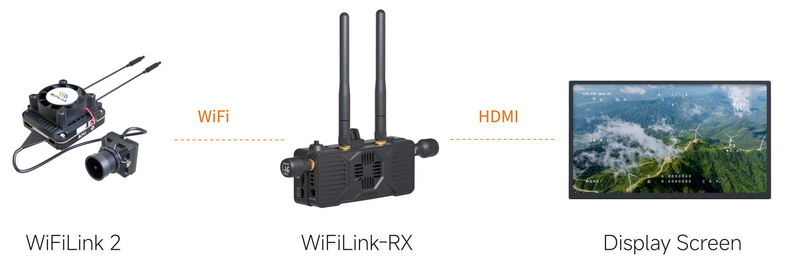
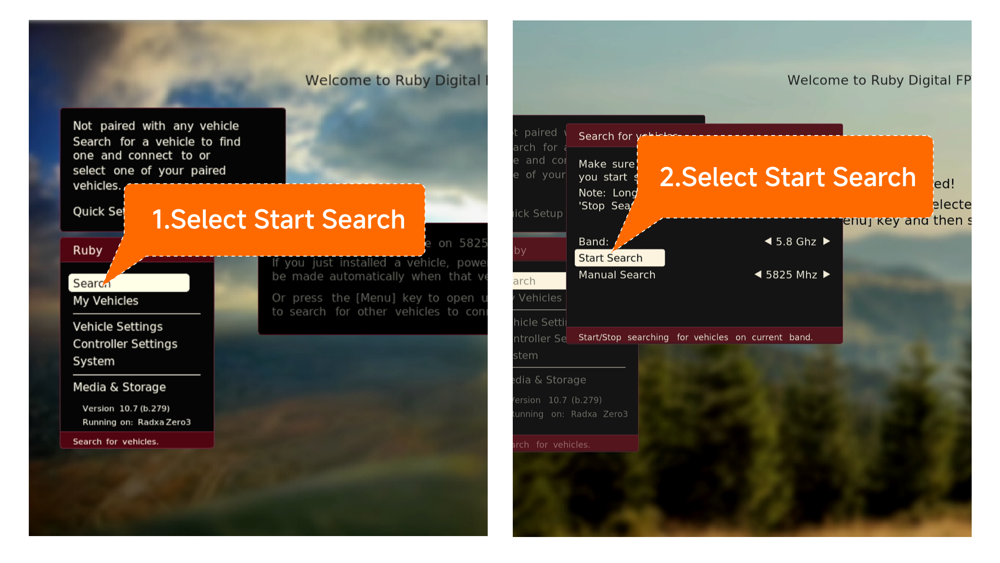
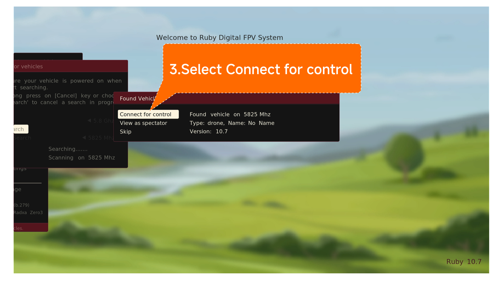

# Connecting to Air Unit

## OpenIPC

Video URL:

1. Install antennas for both WiFiLink2 and WiFiLink-RX, then power both devices. Connect WiFiLink-RX to a display via HDMI cable.

   

2. Once the device has booted up, push the 5-Way Button to the right to set the bandwidth to 20MHz, then push up/down to adjust the frequency to 5805MHz (this is the default frequency).
   

3. Wait about 10 seconds. Once the connection is established, the video feed will be displayed.

   

## Ruby FPV

Video URL:

1. Install antennas for both WiFiLink2 and WiFiLink-RX, then power both devices. Connect WiFiLink-RX to a display via HDMI cable.

   

2. After powering on devices, press down the 5-way button to open the menu, move to select  Search —> Start Search, press to confirm, and it will search the signal of the transmitter.

   

3. When finish the search, please choose “Connect for control”, confirm and connect.

   

4. The feed from transmitter will be displayed when it connects successfully.

   
