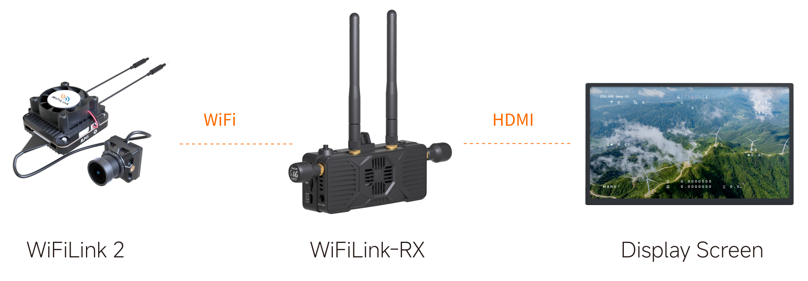
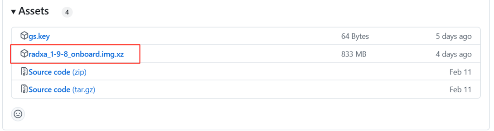
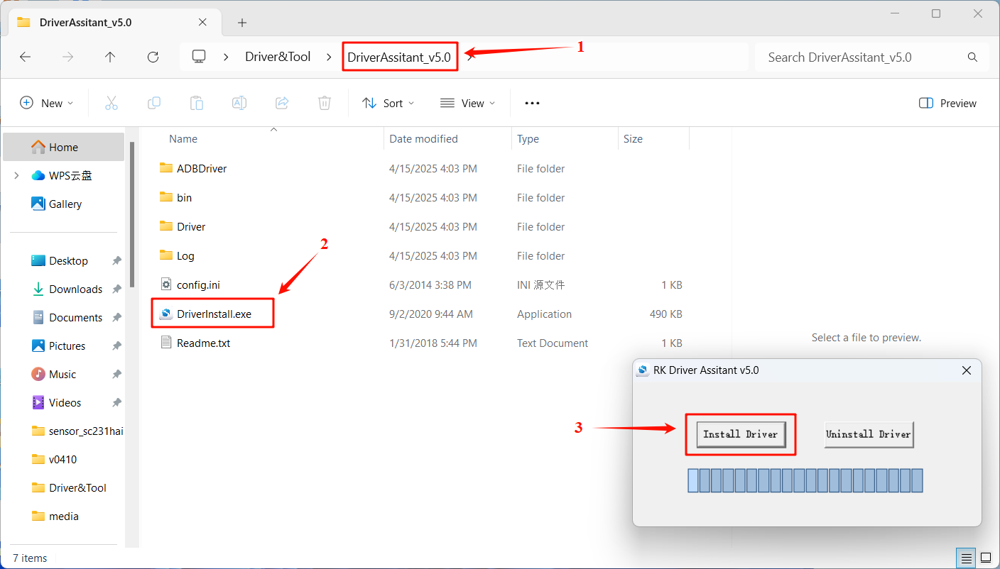
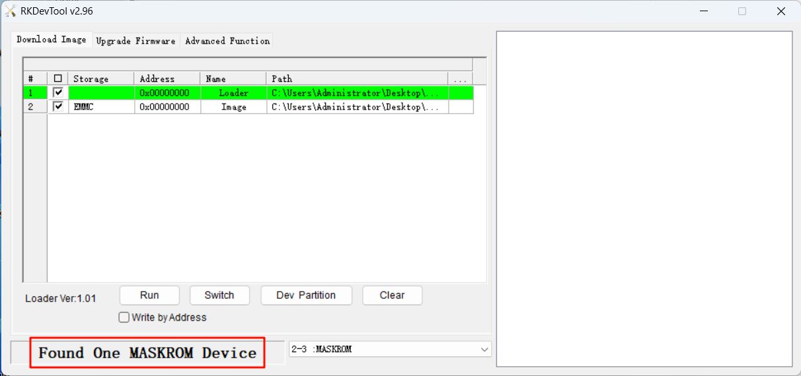
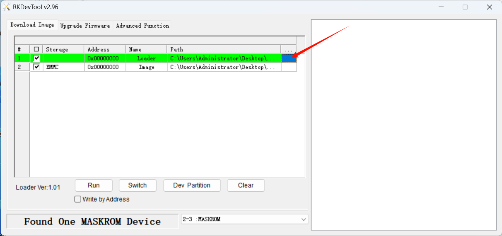
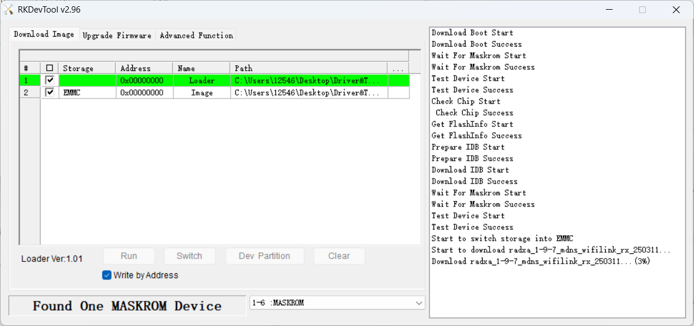

# User Manual——OpenIPC

## Connecting to Air Unit

Video URL:

1. Install antennas for both WiFiLink2 and WiFiLink-RX, then power both devices. Connect WiFiLink-RX to a display via HDMI cable.

   

2. Once the device has booted up, push the 5-Way Button to the right to set the bandwidth to 20MHz, then push up/down to adjust the frequency to 5805MHz (this is the default frequency).
   

3. Wait about 10 seconds. Once the connection is established, the video feed will be displayed.

   

## System Flashing

> [!Warning|style:flat|label：警告]
>
> Flashing the system will erase all files on the WiFiLink-RX’s internal storage (eMMC) and TF card. Please back up important data in advance.
>

Video URL:

### A. Obtaining the System Image file

1. Open the link below, select the target version, and locate the image file with the .img.xz extension.
   https://github.com/OpenIPC/sbc-groundstations/releases

   

2. Extract the downloaded compressed file to obtain a system image file.

   

### B. Flashing Software

1. Click the link below to download the compressed Driver&Tool compressed file.

   GoogleDrive: https://drive.google.com/drive/folders/1moljMrfbCeSgvW7LQA1RAOpFrKZshpGI?usp=sharing

   

2. Extract the downloaded compressed file, to obtain flashing software and driver.

   

### C. Installing Driver

1. Open DriverAssistant_v5.0 folder, find and double click DriverInstall.exe to execute it. Click Install to continue.

   

2. It takes a few seconds to finish.

   

### D. Flashing System Image File

1. Open the RKDevTool_Release_v2.96 folder and locate the RKDevTool.exe file. Double-click to execute it.

   

2. Since the WiFiLink-RX is not yet connected to the computer, the RKDevTool flashing tool will display “No Devices Found” in the lower-left corner.

   

3. Make sure the WiFiLink-RX is properly connected to the antenna, and that the TF card is removed (to prevent data loss).

4. Use a SIM eject tool or a small screwdriver to press and hold the flash button, then connect DC power. Wait for 2 seconds, then release the button.

5. Connect the WiFiLink-RX to the computer via Type-C data cable.

   

6. If the previous steps were completed correctly, the WiFiLink-RX will enter flashing mode. The flashing tool will display “Found One MASKROM device” on the interface.

   

7. When RX enters a flashing mode (MASKROM available), the paths for Loader and Image need to be changed. Click the area shown in the image below to select the “Loader” file.

   

8. Locate Drive&Tool folder and select rk356x_spl_loader_ddr1056_v1.10.111.bin to open.

   

9. Click the area for Image as well.

   

10. Select the system image file to be flashed, then click “Open.” (In this example, version 1.9.7 is used.)

   

11. After selecting the paths for both Loader and Image, please must tick Write by address.

   

12. Click to execute, and the tool will start flashing the firmware for WiFiLink RX.

   

13. It takes about two minutes to finish flashing.

   

## Frequently Asked Questions(FAQ)

### Exporting Videos from Internal Storage

> [!Note|style:flat]
>
> **This feature is available only on version 1.9.7 or later.**

Video URL:

1. After installing the antennas on WiFiLink RX, power on the device. Once the system has fully booted, hold the 5-Way Button to the right for 5 seconds to enter AP Mode (hotspot mode). Connect to the Wi-Fi hotspot named “RadxaGroundstation”, with the password “radxaopenipc”.

   

   

2. Open a browser and go to radxa-zero3.local to access the OpenIPC WebUI (browsing video files and adjusting ground station and camera settings are available here), click “View Video Files” to see the video list, and click “Download” to download videos. (If a TF card is inserted, files stored on the TF card will also appear here.)

   

   
