# User Manual——RubyFPV

## Connecting to Air Unit

Video URL:

1. Install antennas for both WiFiLink2 and WiFiLink-RX, then power both devices. Connect WiFiLink-RX to a display via HDMI cable.

   

2. After powering on devices, press down the 5-way button to open the menu, move to select  Search —> Start Search, press to confirm, and it will search the signal of the transmitter.

   

3. When finish the search, please choose “Connect for control”, confirm and connect.

   

4. The feed from transmitter will be displayed when it connects successfully.

   

## System Flashing

> [!Warning|style:flat]
>
> Flashing the system will erase all files on the WiFiLink-RX’s internal storage (eMMC) and TF card. Please back up important data in advance.
>

Video URL:

### A. Obtaining the System Image file

1. .Go to the Ruby FPV official website’s Download page(https://rubyfpv.com/downloads.php), scroll down to find the latest system image files. Select the image file for RunCam VRx, and click to download.

   !> Note: The system version of the WiFiLink-RX must match the version on the air unit; otherwise, connection issues may occur.

   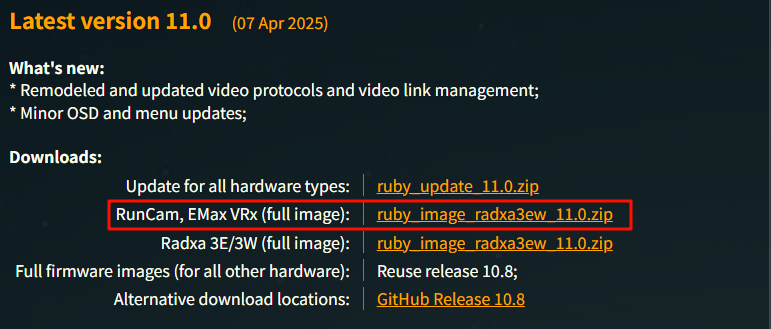

2. Extract the downloaded compressed file to obtain a system image file.

   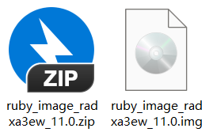

### B. Flashing Software

1. Click the link below to download the compressed Driver&Tool compressed file.

   GoogleDrive: https://drive.google.com/drive/folders/1moljMrfbCeSgvW7LQA1RAOpFrKZshpGI?usp=sharing

   

2. Extract the downloaded compressed file, to obtain flashing software and driver.

   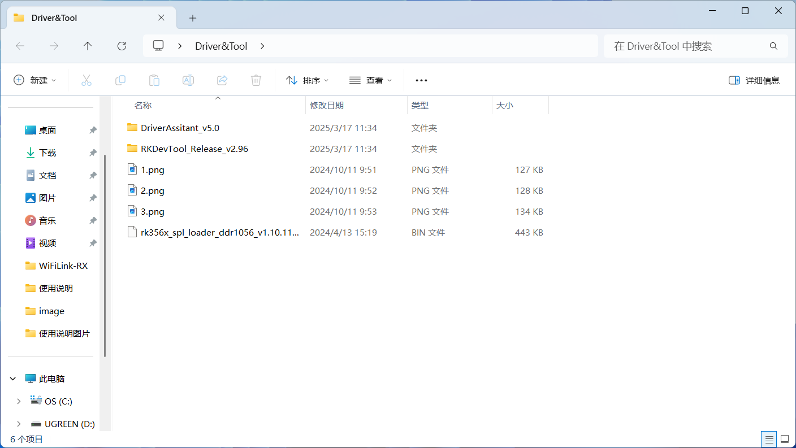

### C. Installing Driver

1. Open DriverAssistant_v5.0 folder, find and double click DriverInstall.exe to execute it. Click Install to continue. 

   

2. It takes a few seconds to finish.

   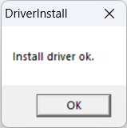

### D. Flashing System Image File

1. Open the RKDevTool_Release_v2.96 folder and locate the RKDevTool.exe file. Double-click to execute it.

   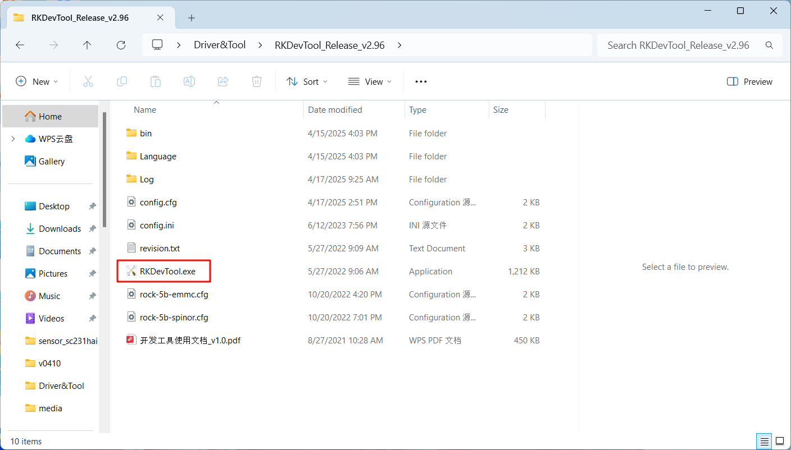

2. Since the WiFiLink-RX is not yet connected to the computer, the RKDevTool flashing tool will display “No Devices Found” in the lower-left corner.

   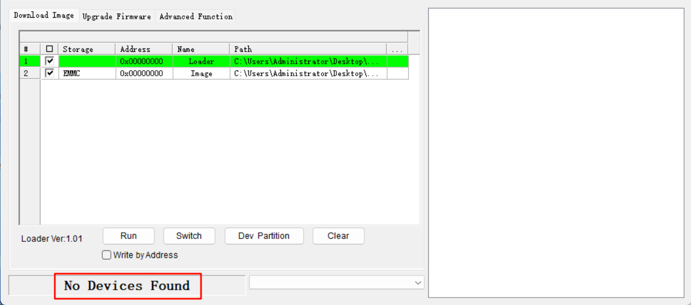

3. Make sure the WiFiLink-RX is properly connected to the antenna, and that the TF card is removed (to prevent data loss).

4. Use a SIM eject tool or a small screwdriver to press and hold the flash button, then connect DC power. Wait for 2 seconds, then release the button.

5. Connect the WiFiLink-RX to the computer via Type-C data cable.

   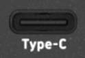

6. If the previous steps were completed correctly, the WiFiLink-RX will enter flashing mode. The flashing tool will display “Found One MASKROM Device” on the interface.

   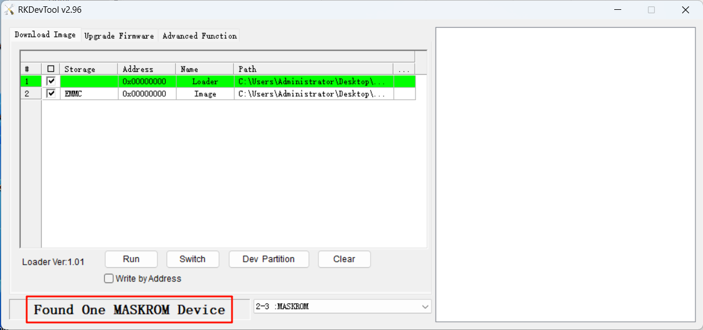

7. When RX enters a flashing mode (MASKROM available), the paths for Loader and Image need to be changed. Click the area shown in the image below to select the “Loader” file.

   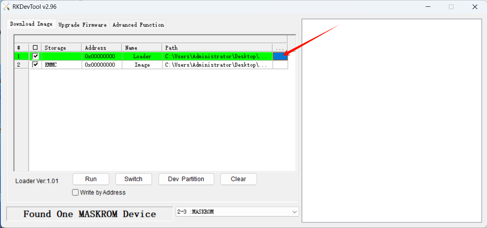

8. Locate Drive&Tool folder and select rk356x_spl_loader_ddr1056_v1.10.111.bin to open.

   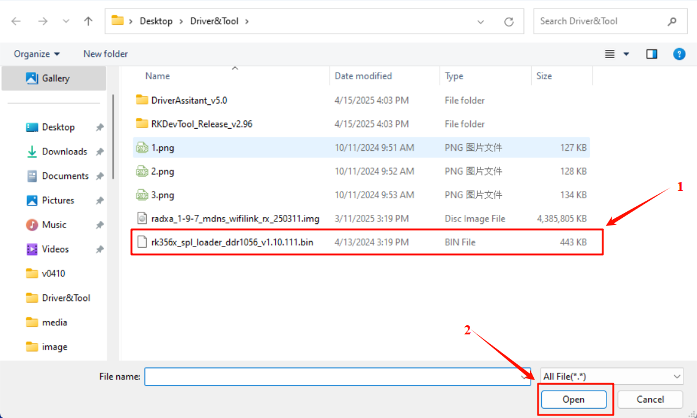

9. Click the area for Image as well.

   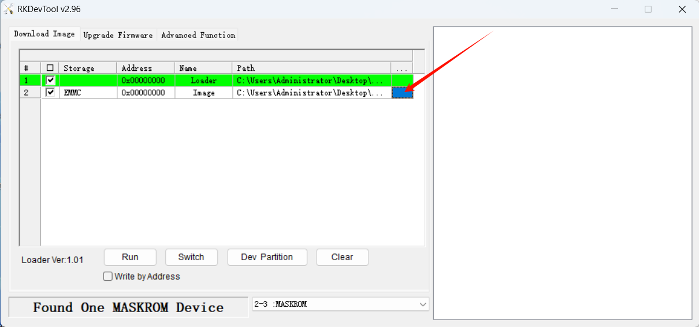

10. Select the system image file to be flashed, then click “Open.” (In this example, version 10.7 is used.)

   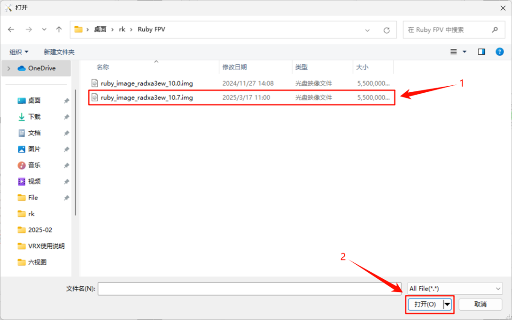

11. After selecting the paths for both Loader and Image, please must tick Write by Address.

   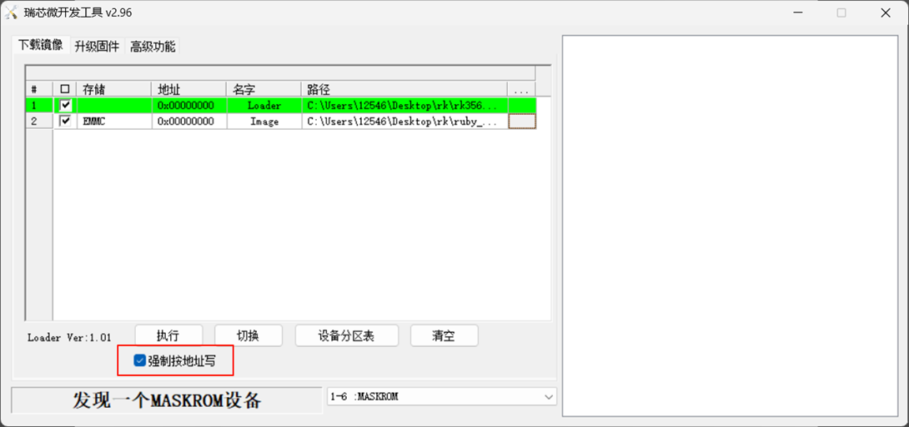

12. Click to execute, and the tool will start flashing the firmware for WiFiLink RX.

   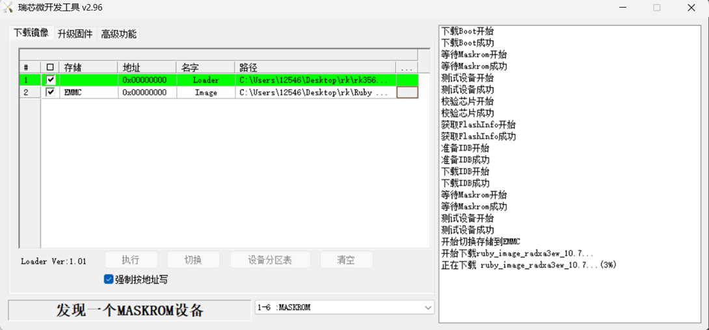

13. It takes about two minutes to finish flashing.

   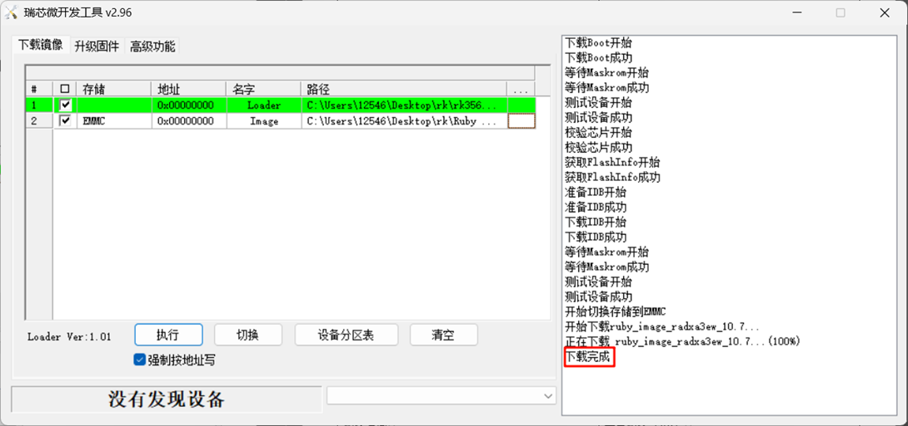

## Frequently Asked Questions(FAQ)

### A. Adjusting WiFiLink-RX Frequency and Air Unit Power

Video URL:

1. Press down on the 5-Way Button to open the menu,then select Quick Vehicle Setup to enter the quick setup menu.

   

2. Select Radio Link Frequency to adjust the frequency channel.

   

3. Select Radio Link Tx Power to adjust the air unit’s transmission power.

   

4. Select FC Telemetry Type to change the telemetry protocol (default is MAVLink).

   

### B. Adjusting Air Unit Video Output via WiFiLink-RX

Video URL:

1. Press down on the 5-Way Button to open the menu bar, then select Vehicles Settings → Video to enter the video settings.

2. Select Video Profile to adjust the video quality. The default is High Quality. High Performance can be selected to achieve lower latency.

   

3. Select Video Codec to adjust the video format. (The default H.264 is recommended.)

   

4. Select Resolution to adjust the video resolution. (Note: Resolutions exceeding 1080P will significantly affect the frame rate and may cause system lag. It is not recommended to exceed 1080P for general use, unless necessary.)

   

5. Select FPS to adjust the video frame rate. (The maximum frame rate varies depending on the resolution setting.)

   

6. Select Video Bitrate to adjust the video bitrate. (The default 6 Mbps is sufficient for most scenarios.)

   

### C. Setting HDMI Video Output on WiFiLink-RX

Video URL:

1. Press down on the 5-Way Button to open the menu bar, then select Controller Settings → Audio & Video Output to enter the settings.

2. Select HDMI Output Resolution to adjust the output resolution.

   

3. Select HDMI Refresh Rate to adjust the output frame rate.

   

### D. Exporting Internal Storage Video from WiFiLink-RX

Video URL:

1. Power on the WiFiLink-RX with the antenna properly connected. After the device starts up, insert a USB drive into the OTG port on the WiFiLink-RX.

   

2. Press down on the 5-Way Button to open the menu, then select Media & Storage → Move media files to USB memory stick. After pressing Confirm, the video files from the internal storage will be moved one by one to the root directory of the USB drive.

   

   

3. Export completed interface.

   
