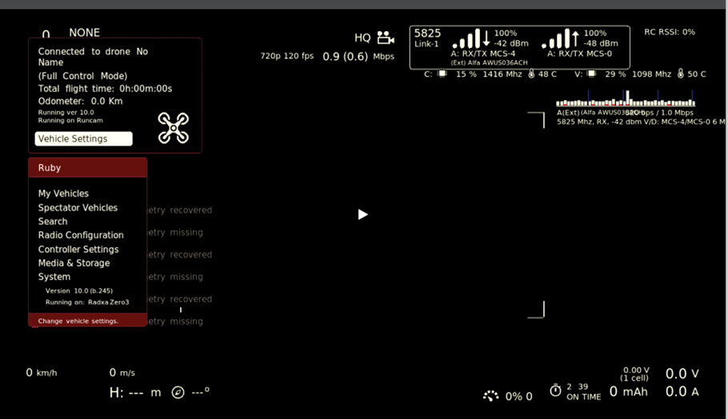
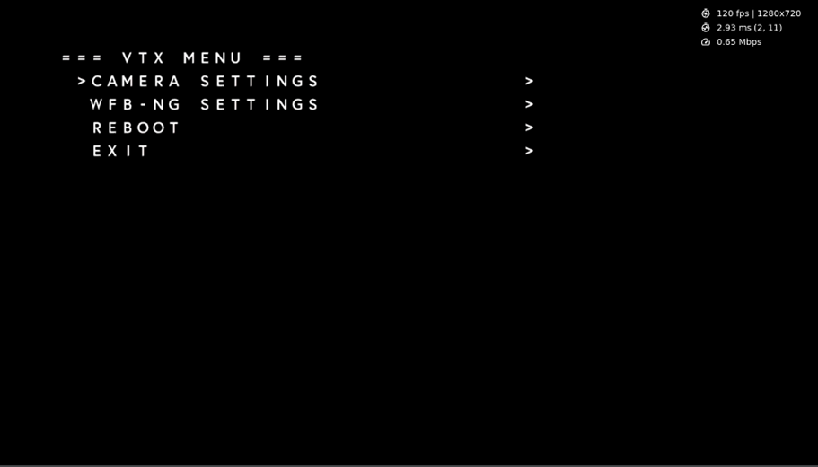
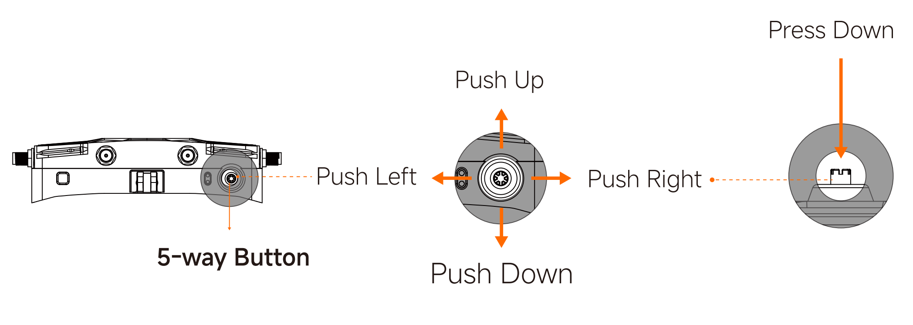
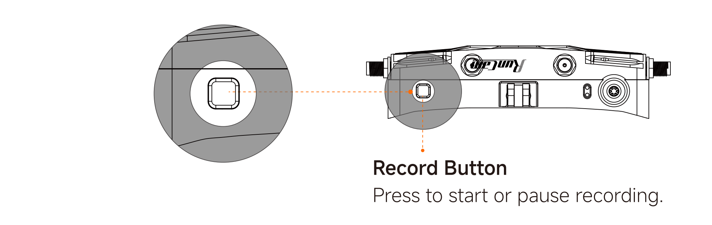
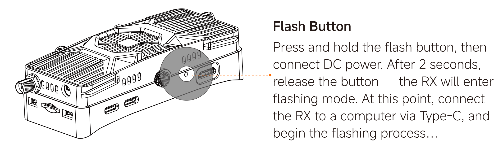

# Product Introduction

 

## Product Overview

| 1.  5-way button    | 2.  LED  | 3.  Detachable mount | 4.  Record button       |
| ------------------- | -------------- | -------------- | ------------------ |
| 5.  1/4inch threaded hole     | 6.  OTG    | 7.  Type-C | 8.  Flash button [^1] |
| 9.  Mini-HDMI       | 10.  SMA(inner pin) | 11.  UART expansion  | 12.  Micro-SD slot  |
| 13.  DC power input[^2] | 14.  I2C expansion   |                |                    |

 [^1]：Use a tool like SIM ejector pin or screwdriver to press.

 [^2]：Input power range: 9V ～ 30V.

## Firmware Support

Supports Ruby FPV or OpenIPC system. The default factory firmware is OpenIPC.

**Ruby FPV Interface Overview**

**OpenIPC Interface Overview**

## LED Status Indicators

| Green LED solid on | Wi-Fi is functioning normally            |
| -------- | ----------------------- |
| Green LED off | Wi-Fi malfunction            |
| Red LED solid on | WiFiLink-RX is powered |
| Red LED slow blinking | Recording in progress                  |
| Red LED fast blinking | Storage is full            |
| Red and green LEDs blinking alternately | High temperature warning                |

## Button Functions

### 5-way Button

**Ruby系统：** Push right to switch OSD interface. Press Down to confirm or open menu. Push up or down to navigate, and Push left to return to the previous menu.

**OpenIPC系统：** Push up or down to change frequencies. Push right to adjust bandwidth (20MHz / 40MHz).

?> Note: The above button functions are based on Ruby FPV V10.7 / OpenIPC V1.9.8. Button behavior may differ in future firmware versions. Please refer to the actual system for the most accurate information.

### Record Button

### Flash Button

## Specifications

| **Model**      | **WiFiLink-RX**                                             |
| ------------- | ----------------------------------------------------------- |
| Frequencies      | 5180~5885 MHz                                               |
| Transmission Power      | <25dBm(FCC) <14dBm(CE) <20dBm(SRRC) <25dBm(MIC) |
| Interface          | Mini-HDMI，Micro-SD，DC5.5×2.1mm，Type-C，OTG       |
| Mini-HDMI Output | 1080P 60fps / 720P 60fps                                    |
| Power Input      | 9 ~ 30V（3 ~ 6S）                                           |
| MicroSD Card        | 支持256G                                                    |
| Memory and Storage    | 1GB RAM + 32GB eMMC                                         |
| System          | Ruby FPV /  OpenIPC                                         |
| Dimensions      | (L)110.0mm×(W)27.3mm×(H)46.0mm                              |
| Weight          | 122.0g（±1g）（antenna excluded）                                 |

| **Model** | **Stick Antennas**        |
| -------- | ------------------- |
| Polarization | Vertical Polarization(VP)      |
| Frequencies | 5150~5850 MHz       |
| Average Gain | 2.5dBi              |
| Standing Wave Ratio(SWR)  | <=2.0               |
| Dimensions | (R)4.8mm×(H)108.4mm |
| Weight     | 6.6g                |

| **Model** | **Pagoda Antennas**       |
| -------- | ------------------ |
| Polarization | Left-Hand Circular Polarization(LHCP) |
| Frequencies | 5500~5900 MHz      |
| Average Gain | 2.5dBi             |
| Standing Wave Ratio(SWR)   | <=2.0              |
| Dimensions | (R)8.0mm×(H)23.9mm |
| Weight     | 4.4g               |

## Notes and Precautions

1. Before powering on, please ensure all antennas are properly installed to avoid damage to components.
2. Please confirm that the display supports the set resolution and frame rate; otherwise, it may cause display issues.
3. If using with other 5.8G devices, please select a different frequency channel.
4. If you experience choppy video, it may be due to interference from other 5.8G devices. Try switching to a different frequency channel to resolve this issue.
5. Before using this product, please ensure you fully understand and comply with local laws and regulations.
