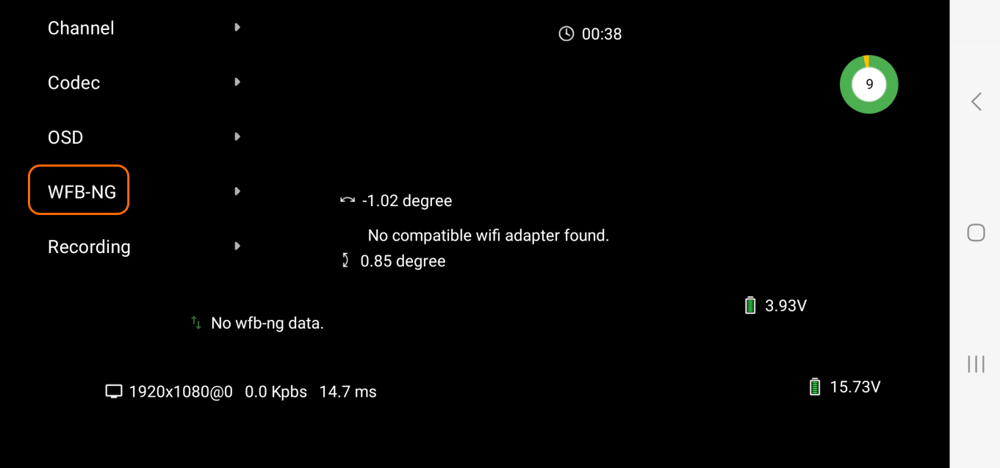
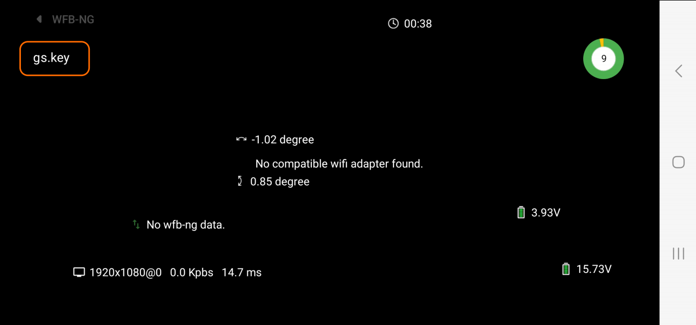
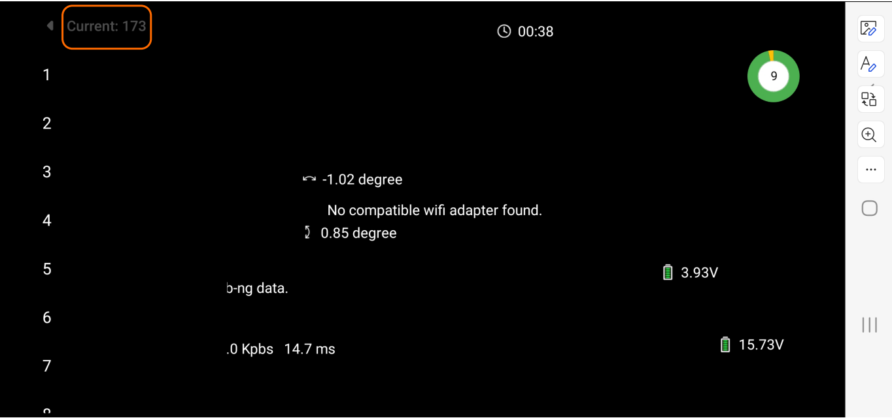
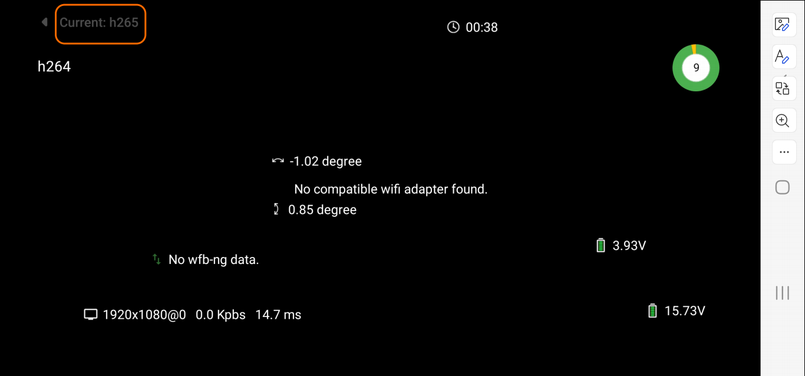
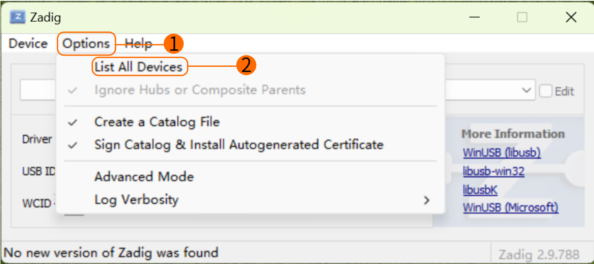
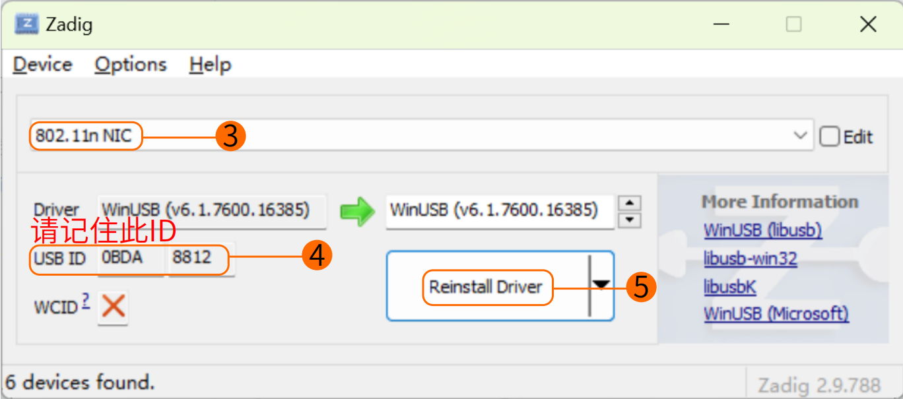
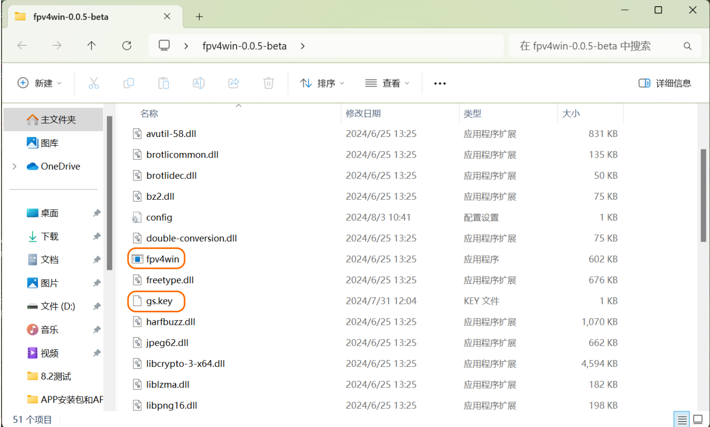
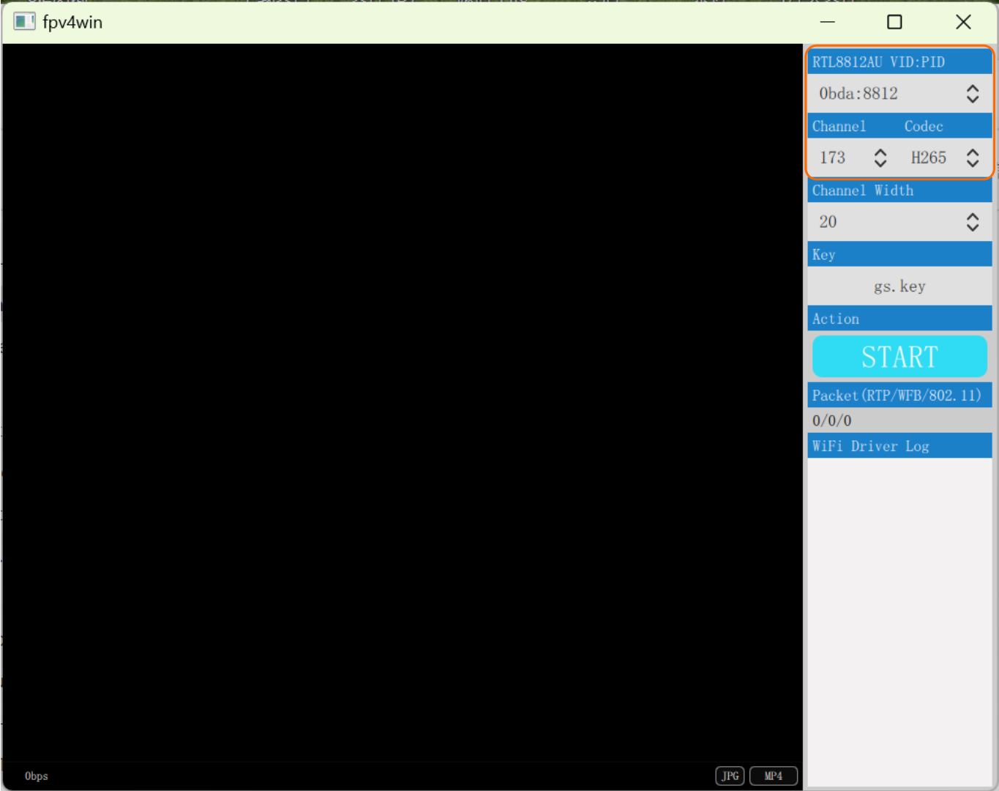
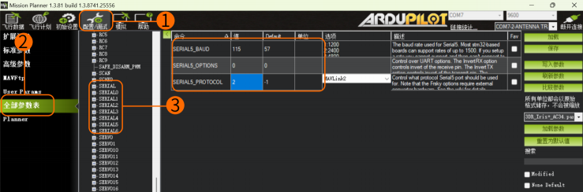

# WiFiLink FAQ

## How to Use WiFiLink

WiFiLink requires no configuration. Simply follow the steps below to use it:

### Install the APP

Install the FPVue APP or PixelPilot on an Android phone.

FPVue APP Download：https://github.com/gehee/FPVue_android/releases

PixelPilot Download：https://github.com/OpenIPC/PixelPilot/releases

### Copy and Replace the Key

Copy the“ gs.key ”key file generated by WiFiLink into the phone's storage.




### Set Parameters

Set the Channel to 173, and the Video Codec to H.265.




### Auxiliary Tool Links

OTG Cable Reference to：https://item.jd.com/10087520840342.html#crumb-wrap 

8812AU Wireless Network Adapter Reference to：https://item.taobao.com/item.htm?id=597898122636

## How to Flash WiFiLink

Card Flashing Steps:

- **Prepare Files**

  Copy the “WiFiLink-part0.bin” and “WiFiLink-part1.bin” card flashing files to the root directory of an empty SD card.
- **Upgrade Steps**

  Insert the SD card into the camera's main board and power it on. The camera will automatically enter upgrade mode (about 15 seconds).
  
  Once the upgrade is complete (about 1 minute), the green light will stay on and the SD card content will be cleared. After re-powering, a new configuration file “( gs.key” and“ user”) will be generated on the SD card.

> Card flashing file:https://www.runcam.com/download/runcamwifilink

## How to Obtain WiFiLink Keys and Configuration Files

Insert the empty SD card into the camera and power it on. The camera will automatically generate the required configuration files upon startup.

## How to Set WiFiLink Parameters

It is recommended to use Notepad++ to edit the user file, which only supports modifying the parameters listed under Available Values, including:

|Channel          |Codec    |
|------------------------|--------------------|
|ResolutionRatio|Bitrate    |
|Mirror          |Flip        |
|Rotate           |Contrast  |
|Hue             |Saturation|
|Luminance        |…                 |

## How to Use the Ethernet Port

Default Settings:
```
IP Address    192.168.1.10
Username      root
Password      12345
```

## How to Pair with Ground Statio

WiFiLink is paired with the FPVue APP by default. If you need to pair it with another ground station, copy the WiFiLink's“gs.key” key to the corresponding location on the ground station.

## What Other Ground Stations Are Compatible

Computer and Radxa ZERO 3W Development Board.

## How to Use with a PC Ground Station

Download：https://github.com/OpenIPC/fpv4win/releases

Follow the steps below:

1. Insert the 8812AU wireless network adapter into the computer and reconfigure the driver using the Zadig program.

   
   
2. Replace the WiFiLink key file (gs.key) in the computer's program folder. Double-click to open the“fpv4win” program, select the correct network adapter, Channel, and Codec, then click START to begin use.

   
   

## How to Use with Radxa ZERO 3

Visit：https://support.runcam.com/hc/en-us

Contact our technical support for detailed guidance.

## Troubleshooting: What to Do If There Is No Video

Check Power Supply: Ensure the power supply is normal and verify that the Channel, Codec, and Key are correctly matched.

## Troubleshooting: No FC OSD Information on Screen题

- **Check Configuration**
  
  Ensure that the configuration settings are correct. The three parameters should be: 115 (corresponding to 115200), 0, 1, or 2 (corresponding to Mavlink1 or 2).
  
  
- **Check Serial Port**
  
  Confirm that the flight controller serial port data is normal and available, and ensure that the serial port wiring is correct. Note that TX and RX must be cross-connected.
