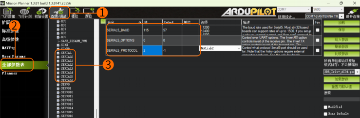

# User Manual

## Usage Instructions

### Install the APP

PixelPilot Download Link:
https://github.com/OpenIPC/PixelPilot/releases

### Set Parameters

Set the Channel to 161 and the Video Codec to h265.


### Auxiliary Tools Links

OTG Cable Reference Link:https://item.jd.com/10087520840342.html#crumb-wrap
8812AU Wireless Adapter Reference Link:https://item.taobao.com/item.htm?id=597898122636

## FAQ

### How to Flash WiFiLink 2

Card Flashing Steps:

**1. Prepare Files**

   Copy WiFiLink-part0.bin and WiFiLink-part1.bin to the root directory of an empty SD card.

**2. Upgrade Steps**

   Insert the SD card into the camera mainboard and power it on. The camera will enter upgrade mode (about 15 seconds), with the green light flashing. After the upgrade (about 1 minute), the green light will turn off, and the SD card will be cleared. Upon re-powering, new configuration files (gs.key and user) will be generated.

> Card Flashing File Address: https://www.runcam.com/download/runcamwifilink2

### How to Obtain Configuration Files

Insert an empty SD card into the camera and power it on. It will generate the configuration files automatically.

### How to Set Parameters

It is recommended to use Notepad++ to edit the user file. Only the parameters listed under "Available values" can be modified, including:

|Channel         |Codec    |
|------------------------|--------------------|
|ResolutionRatio|Bitrate     |
|Mirror           |Flip        |
|Rotate           |Contrast  |
|Hue              |Saturation|
|Luminance        |…                 |

### How to Use the Ethernet Port

Default Settings:
```
IP Address    192.168.1.10
Username      root
Password      12345
```

### How to Use with a PC Ground Station

Program Download: https://github.com/OpenIPC/fpv4win/releases

Follow these steps:

1. Insert the 8812AU wireless adapter into the computer and reconfigure the driver using the Zadig program.

   
   

2. Double-click the fpv4win program, select the network card, Channel, and Codec, then click START to use.

   
   

### How to Use with Radxa ZERO 3W

Visit:https://support.runcam.com/hc/en-us

Contact our technical support team for detailed guidance.

### What to Do if There Is No Display

Check if the power supply is normal and verify that the Channel and Codec settings are correct.

### What to Do if FC OSD Information Is Missing

**1. Check Configuration**

   Verify that the configuration settings are correct. The three parameters should be: 115 (corresponding to 115200), 0, 1, or 2 (corresponding to Mavlink1 or 2).

   

**2. Check the Serial Port**

   Confirm that the FC serial port data is normal and available, and the wiring is correct, with TX and RX
cross-connected.
