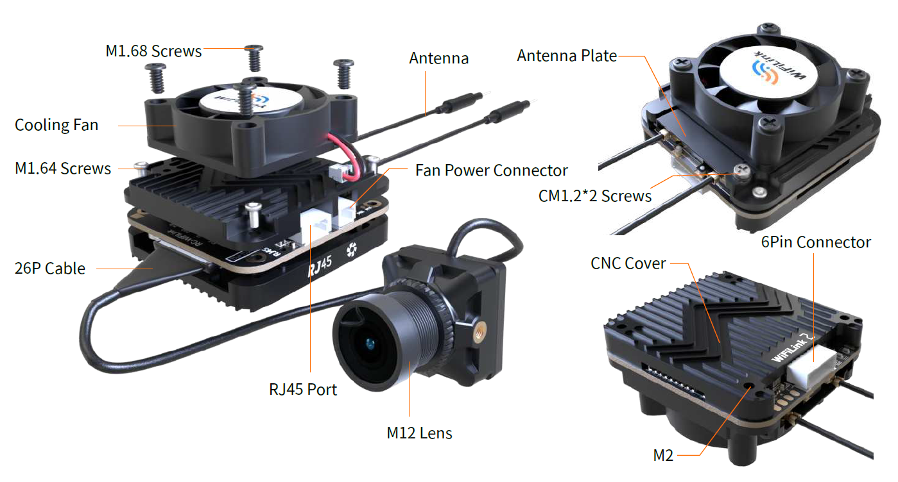
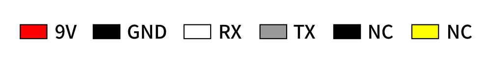

# WiFiLink2

## Product Features

## Installation ＆ Operation Notes

### Antenna Installation

When installing the WiFiLink 2 on the aircraft, pay attention to the following two points:

- **Antenna Layout:** Ensure that the two tail antennas are fully spread apart to avoid entanglement and reduce signal interference.
- **Antenna Orientation:** Point the antennas upward to avoid obstructions from the fuselage or battery, ensuring optimal signal performance.

Refer to the diagram for the optimal antenna layout.

### 6PIN Power Cable Connection

Connect the 6PIN power cable to the flight controller's DJI 6PIN interface.

## Light Introduction

| **Light Status** | **Indication** |
|----------------|--------------|
|Green Off|Audio off|
|Green Solid|Audio on|
|Green Fast Flash|Firmware upgrade|
|Green Slow Flash|Recording on|
|Blue Solid|WiFiLink Startup|
|Blue Fast Flash|WiFi Error|
|Blue & Green Alternating Flash|High Temp Warning (>90°C)|

## Specifications

| **Model** | **WiFiLink2** |
|----------------|--------------|
|Sensor|IMX415|
|FOV|160°|
|Resolution|1080P@60FPS/1080P@90FPS/720P@120FPS|
|Power Supply|9-22V(Max15W)|
|Lens Module|19*19mm/M12Lans/MIPI Cable 130mm|
|Hole Distance|25.5*25.5mm|
|PCB Size|30.6mm*33mm|
|Weight|30g(with fan) /25g(without fan) |
|Antenna|2dB/IPEX1（5G）|
|Power|5.8 GHz:≤29dBm (FCC),≤20dBm(CE)|

## Power Value Reference Table

|Values|20  |25   |30   |35   |40   |45   |50   |55   |58|
|-----|-----|-----|-----|-----|-----|-----|-----|-----|-----|
|dBm|16  |20   |22   |24   |26   |27   |28   |28.5   |29|
|mW|40  |100   |160   |250   |400   |500   |630   |700   |800|

?> The default value is 20.
