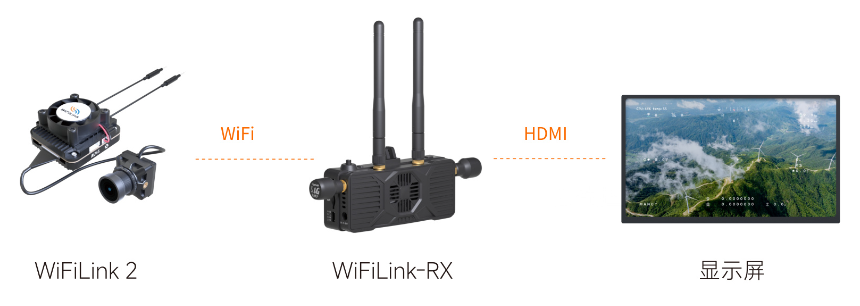
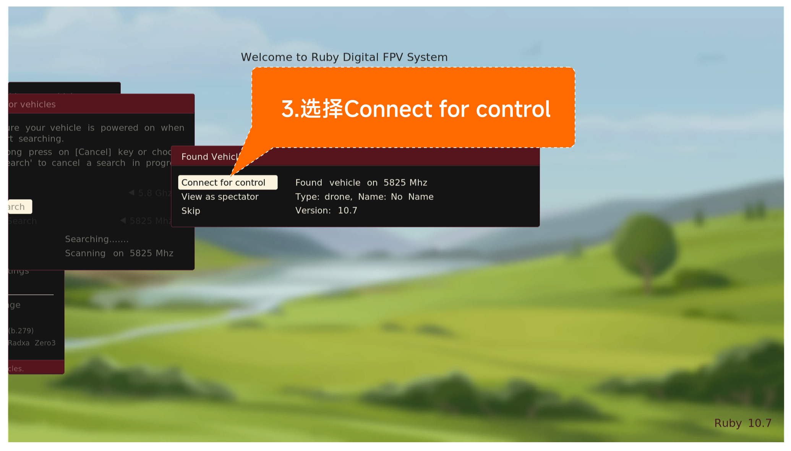

# 连接天空端

## OpenIPC

视频链接：

1. WiFiLink-RX接好天线后供电，通过HDMI连接显示屏，天空端供电。

   

2. 等待设备启动后，右拨5向按键将带宽调整至20Mhz，上下拨动调整频点至5805Mhz（这是默认频点）。

   

3. 等待约10秒，设备连接成功后将输出图传画面。

   

## Ruby FPV

视频链接：

1. WiFiLink-RX接好天线后供电，通过HDMI连接显示屏，天空端供电。

   

2. 等待设备启动后，5向按键下按呼出菜单栏，选择Search —> Start Search，开始搜索图传信号。

   

3. 图传信号搜索完毕后，在弹出界面中选择 Connect for control，开始连接。

   

4. 连接成功后，WiFiLink-RX输出图传画面。

   
