# WiFiLink-RX 使用说明-OpenIPC

## 连接天空端

视频链接：

1. WiFiLink-RX接好天线后供电，通过HDMI连接显示屏，天空端供电。

   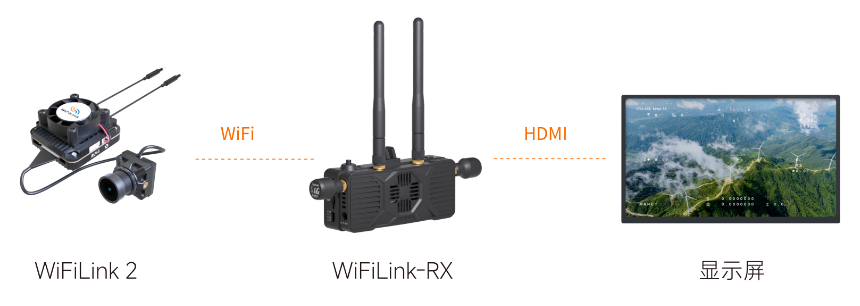

2. 等待设备启动后，右拨5向按键将带宽调整至20Mhz，上下拨动调整频点至5805Mhz（这是默认频点）。

   

3. 等待约10秒，设备连接成功后将输出图传画面。

   

## 系统刷写

> [!Warning|style:flat|label：警告]
>
> 系统刷写会清除WiFiLink-RX内部存储（eMMC）及TF卡中的所有文件，请提前备份重要数据。
>

视频链接：

### （一）获取系统镜像文件

1. 打开下面链接，选择版本然后找到.img.xz后缀镜像文件。
   https://github.com/OpenIPC/sbc-groundstations/releases

   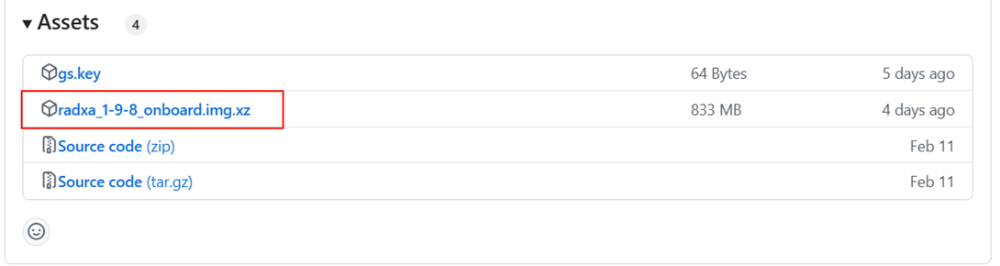

2. 将下载好的zip文件解压，得到系统镜像文件。

   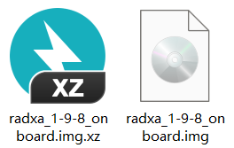

### （二）获取烧录软件

1. 打开下面链接，下载"驱动和软件Driver&Tool.zip"文件。
   https://flowus.cn/share/9a06aa6f-9c0a-43a8-95e8-a50953f72480?code=ADWFHZ

   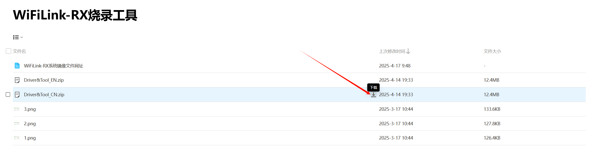

2. 将下载好的zip文件解压，得到烧录软件和驱动文件。

   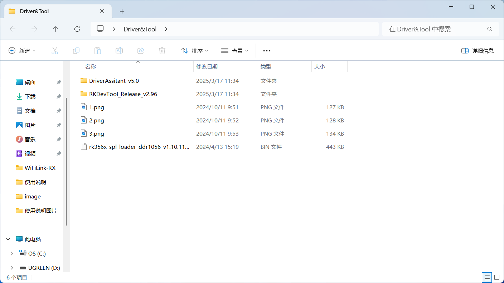

### （三）安装驱动

1. 打开DriverAssitant_v5.0文件夹，找到DriverInstall.exe文件，双击执行，在弹出的界面点击"驱动安装"。

   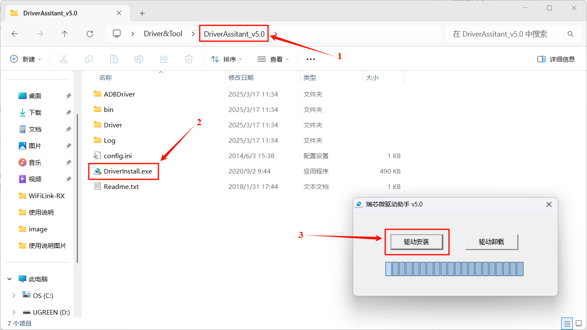

2. 等待几秒，完成安装。

   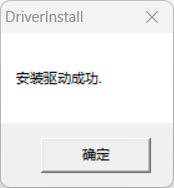

### （四）烧录镜像文件

1. 打开RKDevTool_Release_v2.96文件夹，找到RKDevTool.exe文件，双击执行。

   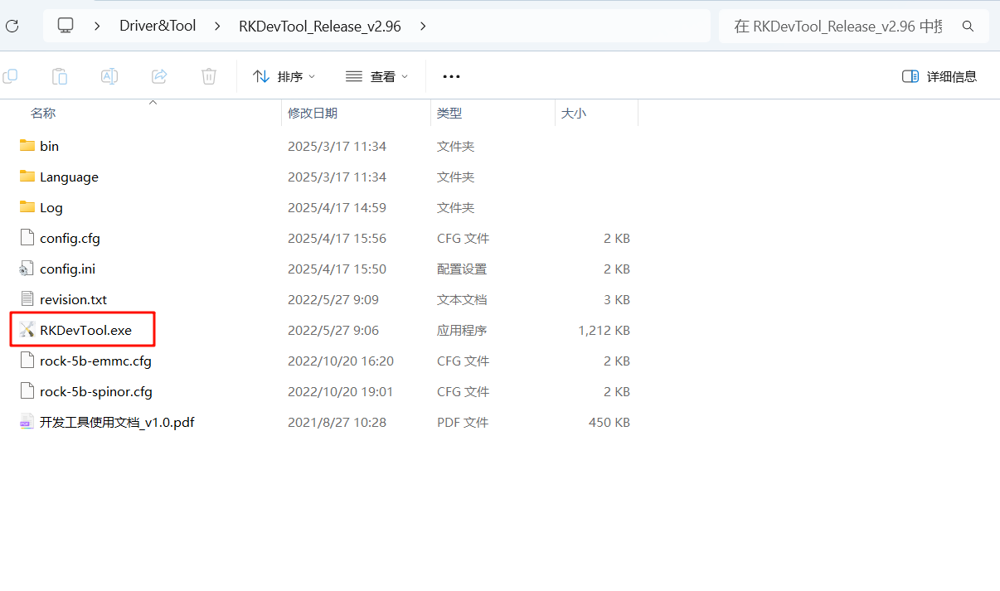

2. 因为此时WiFiLink-RX还没有连接电脑，所以RKDevTool烧录工具左下角会提示"没有发现设备"。

   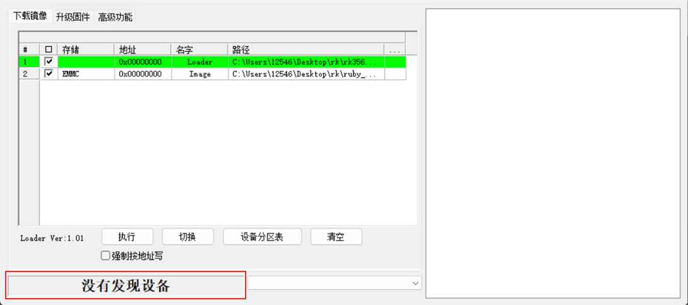

3. 确保 WiFiLink-RX **接好天线，没有插入TF卡(以防卡里文件丢失)** 。

4. 使用卡针或小型螺丝刀按住烧录按键，同时给DC口供电，等待2秒，松开按键。

5. 通过数据线将WiFiLink-RX的Type-C连接电脑。

   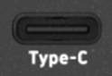

6. 若前面的操作无误，WiFiLink-RX会进入烧录模式，在烧录工具的界面上会提示"发现一个MASKROM设备"。

   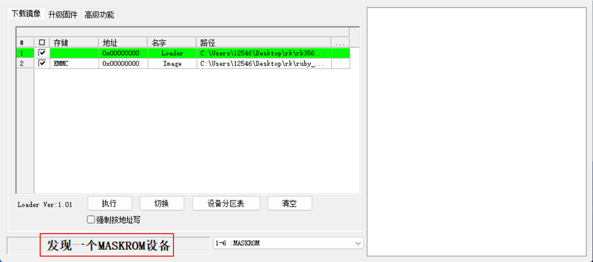

7. 点击下图所示的位置，选取"Loader"文件。

   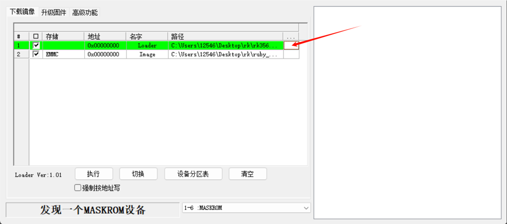

8. 找到文件夹中rk356x_spl_loader_ddr1056_v1.10.111.bin，再点击"打开"。

   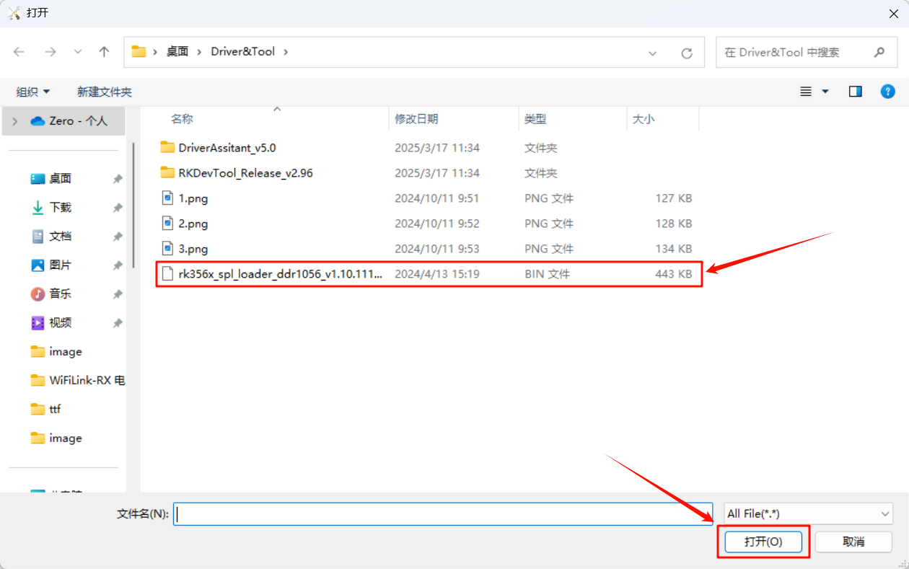

9. 然后点击下图所示的位置，选取"Image"文件。

   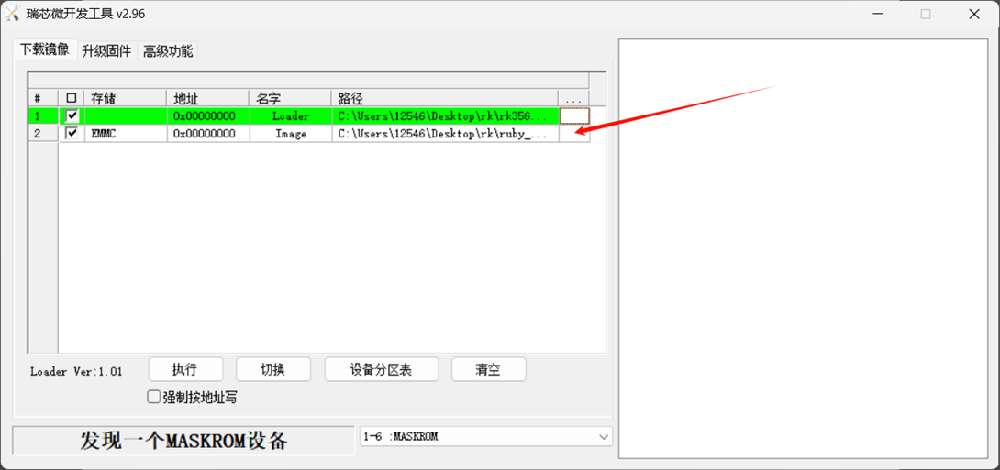

10. 选择将要烧录的系统镜像文件，再点击"打开"。（以1.9.8版本为例）

    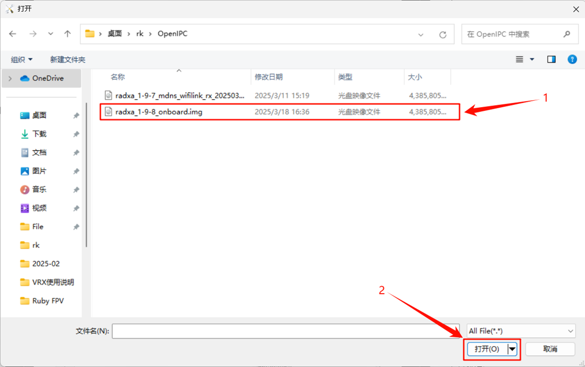

11. 然后勾选"强制按地址写"选项。

    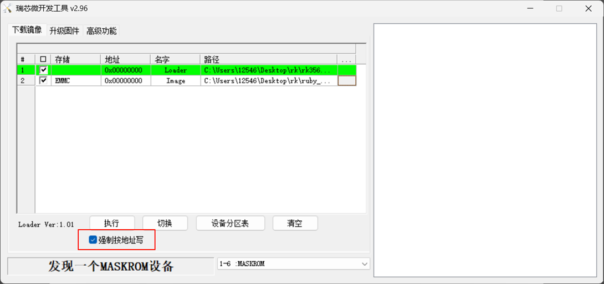

12. 再点击"执行"，开始烧录。

    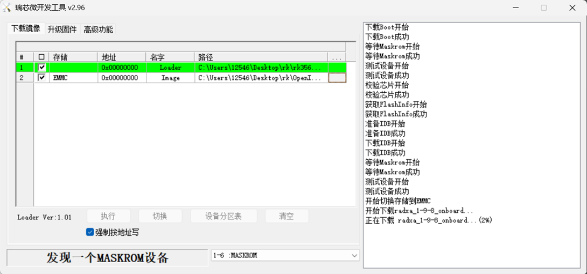

13. 等待大概两分钟，完成系统烧录。

    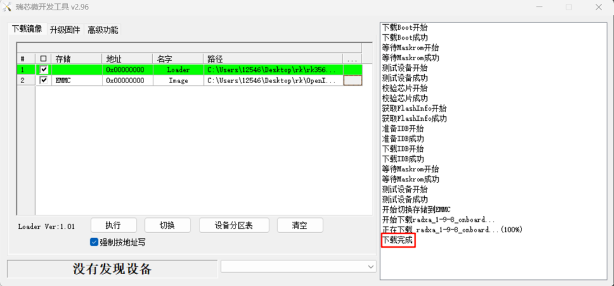

## 常见问题（FAQ）

### （一）WiFiLink-RX 导出内部存储视频

> [!Note|style:flat|label:注意]
>
> **该功能需要更新至1.9.7及之后的版本才能实现**

视频链接：

1. WiFiLink-RX接好天线后，供电，待系统启动完全，右拨5向按键保持5秒，WiFiLink-RX进入AP模式(打开热点模式)，连接热点“RadxaGroundstation”，密码为“radxaopenipc”。

   

   

2. 在浏览器中打开 radxa-zero3.local 页面，进入OpenIPC的WebUI(我们可以在这里访问视频文件、调整地面站和摄像机参数)，点击“View Video Files”，查看视频列表，点击“Download”下载视频。（如果插入了TF卡，TF卡内的视频文件也会一并显示在这里。）

   

   
