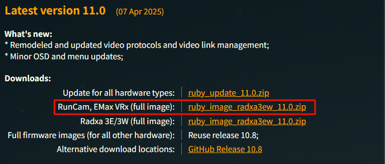
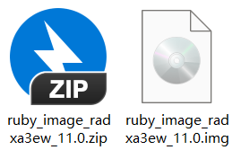
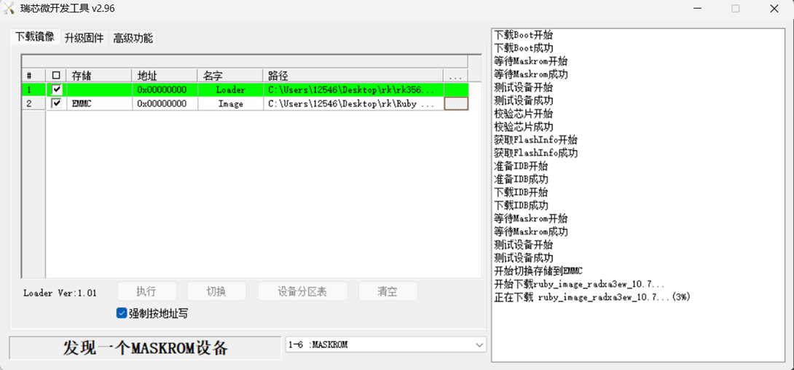
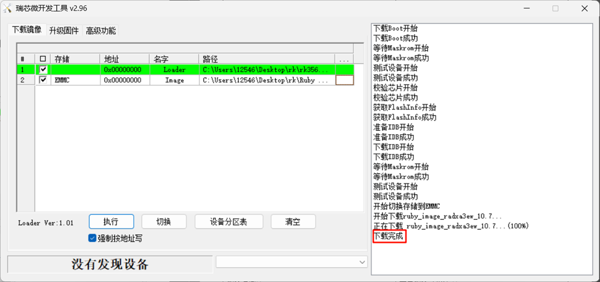

# WiFiLink-RX 使用说明-RubyFPV系统 V1.0

## 连接天空端

视频链接：

1. WiFiLink-RX接好天线后供电，通过HDMI连接显示屏，天空端供电。

   

2. 等待设备启动后，5向按键下按呼出菜单栏，选择Search —> Start Search，开始搜索图传信号。

   

3. 图传信号搜索完毕后，在弹出界面中选择 Connect for control，开始连接。

   

4. 连接成功后，WiFiLink-RX输出图传画面。

   

## 系统刷写

> [!Warning|style:flat|label：警告]
> 系统刷写会清除WiFiLink-RX设备内部存储（eMMC）及TF卡中的所有文件，请提前备份重要数据。

视频链接：

### （一）获取系统镜像文件

1. 打开Ruby FPV官网的Download页面（https://rubyfpv.com/downloads.php），下滑找到最新版系统镜像文件，选择 RunCam VRx 的镜像文件，点击下载。

   !>注意：WiFiLink-RX的系统版本号与天空端的系统版本号要相对应，否则会出现连接问题

   

2. 将下载好的zip文件解压，得到系统镜像文件。

   

### （二）获取烧录软件

1. 打开下面链接，下载"驱动和软件Driver&Tool.zip"文件。
   https://flowus.cn/share/9a06aa6f-9c0a-43a8-95e8-a50953f72480?code=ADWFHZ

   

2. 将下载好的zip文件解压，得到烧录软件和驱动文件。

   

### （三）安装驱动

1. 打开烧录软件的DriverAssitant_v5.0文件夹，找到DriverInstall.exe文件，打开执行，在弹出的界面点击"驱动安装"。

   

2. 等待几秒，完成安装。

   

### （四）烧录镜像文件

1. 打开RKDevTool_Release_v2.96文件夹，找到RKDevTool.exe文件，双击执行。

   

2. 因为此时WiFiLink-RX还没有连接电脑，所以RKDevTool烧录工具左下角会提示"没有发现设备"。

   

3. 确保 WiFiLink-RX **接好天线，没有插入TF卡(以防卡里文件丢失)**。

4. 使用卡针或小型螺丝刀按住烧录按键，同时给DC口供电，等待2秒，松开按键。

5. 通过数据线将WiFiLink-RX的Type-C连接电脑。

   

6. 若前面的操作无误，WiFiLink-RX会进入烧录模式，在烧录工具的界面上会提示"发现一个MASKROM设备"。

   

7. 点击下图所示的位置，选取"Loader"文件。

   

8. 找到文件夹中rk356x_spl_loader_ddr1056_v1.10.111.bin，再点击"打开"。

   

9. 然后点击下图所示的位置，选取"Image"文件。

   

10. 选择将要烧录的系统镜像文件，再点击"打开"。（这里以10.7版本为例）

    

11. 然后勾选"强制按地址写"选项。

    

12. 再点击"执行"，开始烧录。

    

13. 等待大概两分钟，完成系统烧录。

    

## 常见问题（FAQ）

### （一）调整频点及天空端发射功率

视频链接：

1. 5向按键下按呼出菜单栏，选择 Quick Setup 进入快速设置。

   

2. 选择Radio Link Frequency 调整频点。

   

3. 选择 Radio Link Tx Power 调整天空端发射功率 。

   

4. 选择 FC Telemetry Type 更换协议，默认是MAVLink。

   

### （二）调整天空端视频输出

视频链接：

1. 5向按键下按呼出菜单栏，选择 Vehicles Settings —> Video  进入设置。

2. 选择 Video Profile 调整视频质量，默认是High Quality(高质量)，如有低延时需求可以调整为High Performance(高性能) 。

   

3. 选择 Video Codec 调整视频格式（使用默认H.264即可）。

   

4. 选择 Resolution 调整视频分辨率（分辨率超过1080P时帧率会显著降低且可能会导致系统卡顿，非特殊需求不建议调整分辨率超过1080P）。

   

5. 选择 FPS 调整视频帧率（不同分辨率设置下的最大帧率不同）。

   

6. 选择 Video Bitrate 调整视频码率（默认6mps足以应对大多数场景）。

   

### （三）HDMI视频输出设置

视频链接：

1. 5向按键下按呼出菜单栏，选择 Controller Settings —> Audio & Video Output  进入设置。

2. 选择HDMI output resolution 调整输出分辨率。

   

3. 选择HDMI refresh rate 调整输出帧率。

   

### （四）导出内部存储视频

视频链接：

1. WiFiLink-RX接好天线供电，等待设备启动后，将U盘插入WiFiLink-RX的OTG接口。

   

2. 5向按键下按呼出菜单栏，选择Media & Storage —>Move media files to USB memory stick，按下确定后，内部存储的视频文件将会逐一移至U盘的根目录下。

   

   

3. 导出完成界面。

   
