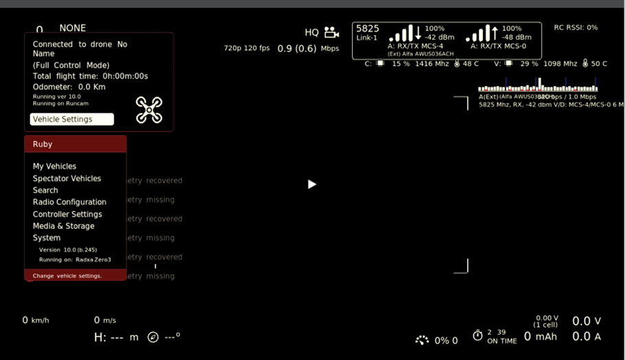
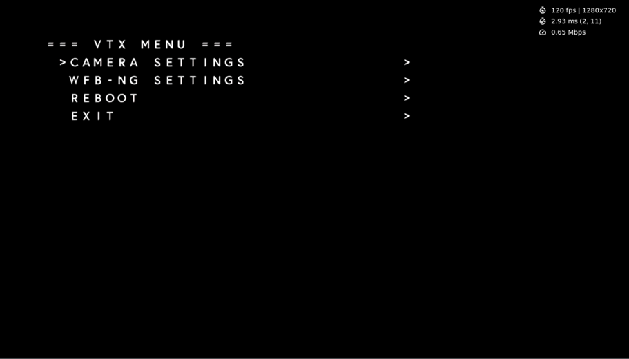
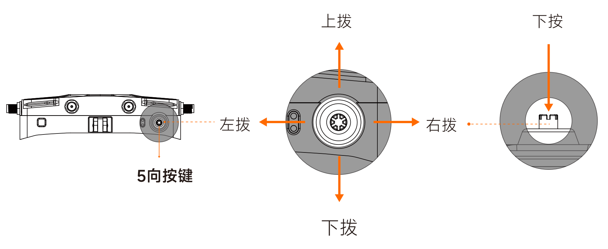
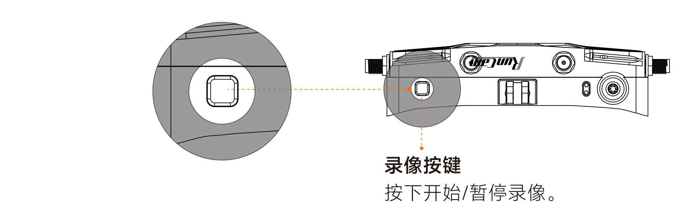
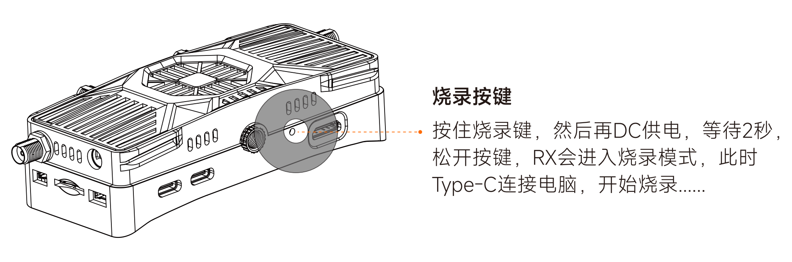

# 产品介绍

 

## 产品概览

| 1.  5向按键          | 2.  LED指示灯  | 3.  可拆卸支架 | 4.  录像按键       |
| ------------------- | -------------- | -------------- | ------------------ |
| 5.  1/4英寸螺孔     | 6.  OTG接口    | 7.  Type-C接口 | 8.  烧录按键 [^1] |
| 9.  Mini-HDMI接口        | 10.  SMA天线座(内针) | 11.  串口拓展  | 12.  Micro-SD卡座  |
| 13.  DC电源输入[^2] | 14.  I2C拓展   |                |                    |

 [^1]：需使用卡针或小型螺丝刀操作。

 [^2]：输入电压范围为9~30V。

## 固件支持

支持Ruby FPV或OpenIPC系统运行，出厂默认Ruby FPV系统。

**Ruby FPV界面一览**

**OpenIPC界面一览**

## LED状态指示

| 绿灯常亮 | WIFI工作正常            |
| -------- | ----------------------- |
| 绿灯熄灭 | WIFI工作异常            |
| 红灯常亮 | WiFiLink-RX通电工作正常 |
| 红灯慢闪 | 录像中                  |
| 红灯快闪 | 存储空间已满            |
| 红绿双闪 | 高温报警                |

## 按键操作

### 5向按键

**Ruby系统：** 右拨切换OSD风格。下按确认/呼出菜单栏，上拨、下拨移动位置，左拨返回上一级菜单。

**OpenIPC系统：** 上拨、下拨切换频点，右拨调整带宽(20MHz/40MHz)。

?>以上按键定义基于Ruby FPV 10.7 / OpenIPC 1.9.8版本，后续版本的按键定义可能会与当前有所差异，请以实际为准。

### 录像按键

### 烧录按键

## 规格参数

| **型号**      | **WiFiLink-RX**                                             |
| ------------- | ----------------------------------------------------------- |
| 通信频率      | 5180~5885 MHz                                               |
| 发射功率      | <25dBm(FCC) <14dBm(CE) <20dBm(SRRC) <25dBm(MIC) |
| 接口          | Mini-HDMI，Micro-SD卡槽，DC5.5×2.1mm，Type-C，OTG接口       |
| Mini-HDMI输出 | 1080P 60fps / 720P 60fps                                    |
| 电源输入      | 9 ~ 30V（3 ~ 6S）                                           |
| SD卡槽        | 支持256G                                                    |
| 内存与存储    | 1GB RAM + 32GB eMMC                                         |
| 系统          | Ruby FPV /  OpenIPC                                         |
| 外形尺寸      | (L)110.0mm×(W)27.3mm×(H)46.0mm                              |
| 重量          | 122.0g（±1g）（不包括天线）                                 |

| **型号** | **棒状天线**        |
| -------- | ------------------- |
| 极化方向 | 垂直极化（VP）      |
| 工作带宽 | 5150~5850 MHz       |
| 平均增益 | 2.5dBi              |
| 驻波比   | <=2.0               |
| 外形尺寸 | (R)4.8mm×(H)108.4mm |
| 重量     | 6.6g                |

| **型号** | **蘑菇天线**       |
| -------- | ------------------ |
| 极化方向 | 左旋圆极化（LHCP） |
| 工作带宽 | 5500~5900 MHz      |
| 平均增益 | 2.5dBi             |
| 驻波比   | <=2.0              |
| 外形尺寸 | (R)8.0mm×(H)23.9mm |
| 重量     | 4.4g               |

## 注意事项

1. 通电前，请安装好所有天线，避免元器件损坏。
2. 请确认显示器支持所设置的分辨率和帧率，否则可能会导致出图异常。
3. 如果您同时与其他5.8GHz设备一起使用，请选择不同的频点。
4. 如果遇到画面不流畅，可能是受到其他5.8GHz设备的干扰，可以尝试切换频点进行解决。
5. 使用本产品前，请确保您充分了解并遵守当地法律法规。
