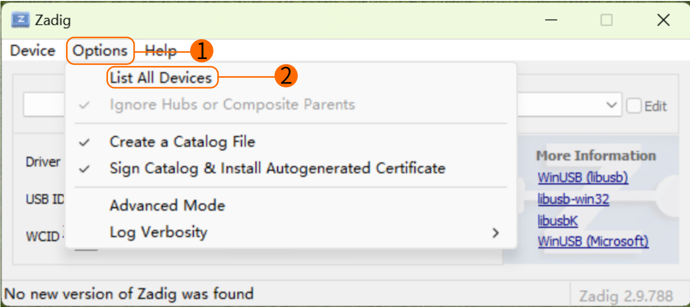

# WiFiLink 常见问题解答

## WiFiLink如何使用

WiFiLink无需任何配置，只需按以下步骤操作即可使用：

### 安装APP

在安卓手机上安装FPVue APP或者PixelPilot。

FPVue APP下载链接：https://github.com/gehee/FPVue_android/releases

PixelPilot下载链接：https://github.com/OpenIPC/PixelPilot/releases

### 复制替换秘钥

将卡里生成的WiFiLink的gs.key秘钥文件复制到手机存储中。


### 设置参数

将信道（Channel）设置为173，视频编码（Codec）设置为h265。


### 辅助工具链接

OTG连接线参考链接：https://item.jd.com/10087520840342.html#crumb-wrap 

8812AU无线网卡参考链接：https://item.taobao.com/item.htm?id=597898122636

## WiFiLink如何卡刷

按照以下步骤即可卡刷：

- **准备文件**

  将WiFiLink-part0.bin和WiFiLink-part1.bin两个卡刷文件复制到一张空SD卡的根目录。

- **升级步骤**

  将SD卡插入相机主板，通电。相机启动后将自动进入升级状态（约15秒），升级过程中绿灯闪烁。升级完成后（约1分钟），绿灯常亮。此时SD卡内容将被清空。重新供电后，SD卡中将生成新的配置文件（gs.key和user）。

> 卡刷文件地址：https://www.runcam.com/download/runcamwifilink

## 如何获取WiFiLink秘钥与配置文件

将空SD卡插入相机并供电，启动后相机将自动生成所需配置文件。

## 如何设置WiFiLink参数

建议使用notepad++编辑user文件，仅支持修改Available values中列出的参数，包括

|Channel（信道）          |Codec（视频编码）    |
|------------------------|--------------------|
|ResolutionRatio（分辨率）|Bitrate（码率）     |
|Mirror（镜像）           |Flip（翻转）        |
|Rotate（旋转）           |Contrast（对比度）  |
|Hue（色相）              |Saturation（饱和度）|
|Luminance（亮度）        |……                 |

## 网口如何使用

默认设置：
```
IP地址    192.168.1.10
用户名    root
密码      12345
```

## 如何与地面站配对

WiFiLink默认与FPVue APP配对。如需与其他地面站配对，将WiFiLink的秘钥gs.key复制到地面站对应位置即可。

## 还能与哪些地面站搭配使用

电脑和Radxa ZERO 3W开发板。

## 如何与电脑端地面站搭配使用

程序下载链接：https://github.com/OpenIPC/fpv4win/releases

请按照以下步骤操作：

1. 电脑插上8812AU无线网卡，并使用zadig程序重新配置驱动。

   

   
2. 将WiFiLink的秘钥文件gs.key替换到电脑程序文件夹中。双击打开fpv4win程序，选择正确的网卡、Channel和Codec，点击START开始使用。

   

   

## 如何与Radxa ZERO 3W搭配使用

请访问：https://support.runcam.com/hc/en-us

联系我们的技术支持获取详细指导。

## 若无画面，应该如何排查问题

检查供电是否正常，并确认Channel、Codec、Key是否匹配正确。

## 画面上没有飞控的OSD信息，如何排查问题

- **检查配置**
  
  检查配置设置是否正确，三个参数为:115（对应115200），0，1或者2（对应Mavlink1或者2）。
  
  
- **检查串口**
  
  确认飞控串口数据正常且可用，并检查串口接线是否正确，注意TX与RX须交叉连接。
