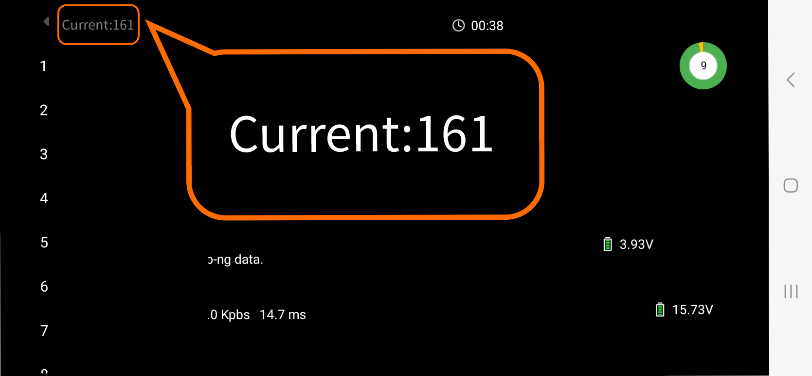
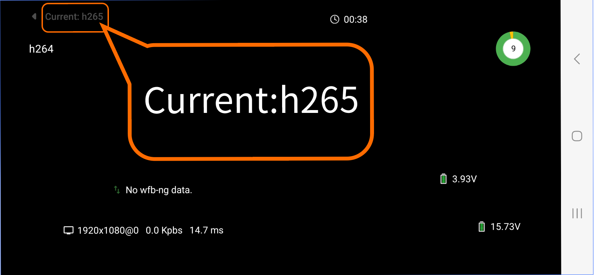

# 使用操作

## 安装APP

PixelPilot下载链接：
https://github.com/OpenIPC/PixelPilot/releases

## 设置参数

将信道（Channel）设置为**161**，视频编码（Codec）设置为**h265**。

## 辅助工具链接

OTG连接线参考链接：https://item.jd.com/10087520840342.html#crumb-wrap

8812AU无线网卡参考链接：https://item.taobao.com/item.htm?id=597898122636
