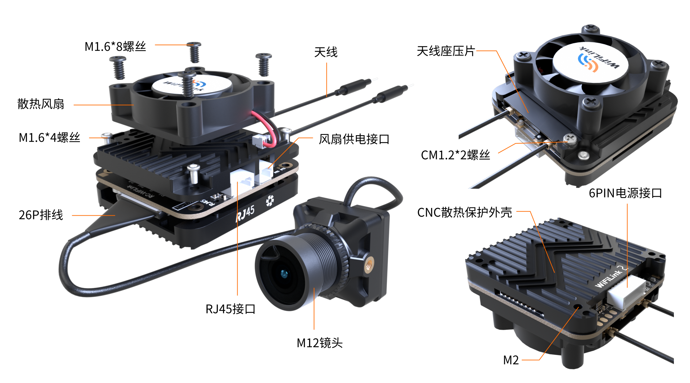
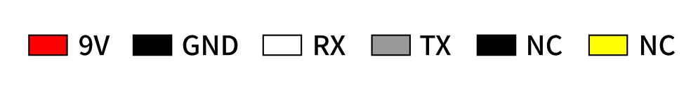

# WiFiLink2

## 产品功能指示

## 安装操作注意事项

### 天线安装

将WiFiLink2安装至飞行器上时，请特别注意两点：

- **天线布局：** 确保两个尾巴天线充分岔开，避免相互交缠，以减少信号干扰。
- **天线方向：** 尽可能将天线调整为上翘状态，避免天线被机身或电池遮挡，确保信号接收与发射效果最佳。

请参照示意图进行安装，此布局为最佳天线配置方式。

### 6PIN 供电线插接

6PIN供电线与飞控的DJI 6PIN接口连接。

## 灯光介绍

| **指示灯状态** | **功能说明** |
|----------------|--------------|
|绿灯熄灭|音频关闭|
|绿灯常亮|打开音频|
|绿灯快闪|固件升级|
|绿灯慢闪|打开录像|
|蓝灯常亮|WiFiLink已启动|
|蓝灯快闪|WIFI异常|
|蓝绿灯交替闪烁|高温提示（大于90度）|

## 参数表

| **型号** | **WiFiLink2** |
|----------------|--------------|
|传感器|IMX415|
|FOV|160°|
|分辨率|1080P@60FPS/1080P@90FPS/720P@120FPS|
|供电|9-22V(最大功耗15W)|
|镜头模组规格|19*19mm/M12镜头/MIPI线长130mm|
|孔间距|25.5*25.5mm|
|PCB尺寸|30.6mm*33mm|
|重量|30g(包含风扇) /25g(不包含风扇) |
|天线|2dB/IPEX1（5G）|
|功率|5.8 GHz:≤29dBm (FCC),≤20dBm(CE)|

## 数值功率对应表

|数值|20  |25   |30   |35   |40   |45   |50   |55   |58|
|-----|-----|-----|-----|-----|-----|-----|-----|-----|-----|
|dBm|16  |20   |22   |24   |26   |27   |28   |28.5   |29|
|mW|40  |100   |160   |250   |400   |500   |630   |700   |800|

?> 默认数值是20。
